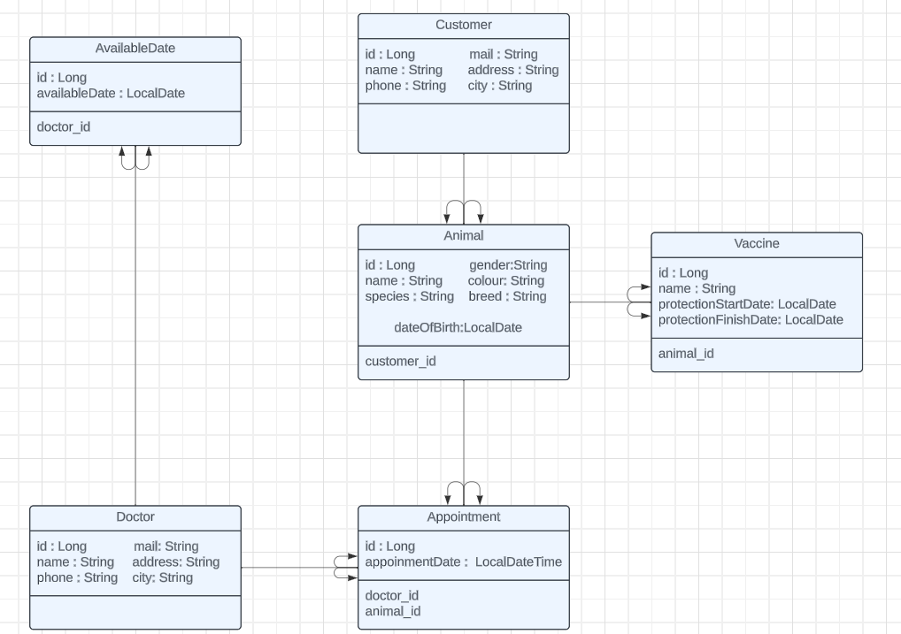

# Pet Clinic

# Animal
| HTTP   |             Endpoint              |               Description |
|--------|:---------------------------------:|--------------------------:|
| GET    |            v1/animals             |           Get All Animals |
| POST   |            v1/animals             |            Add New Animal |
| DELETE |          v1/animals/{id}          |             Delete Animal |
| PUT    |          v1/animals/{id}          |             Update Animal |
| GET    |          v1/animals/{id}          |          Get Animal By Id |
| GET    |       v1/animals/name?name=       |        Get Animal By Name |
| GET    | v1/animals/customerId?customerId= | Get Animal By Customer Id |

# Customer
| HTTP   |        Endpoint         |          Description |
|--------|:-----------------------:|---------------------:|
| GET    |      v1/customers       |    Get All Customers |
| POST   |      v1/customers       |     Add New Customer |
| DELETE |    v1/customers/{id}    |      Delete Customer |
| PUT    |    v1/customers/{id}    |      Update Customer |
| GET    |    v1/customers/{id}    |   Get Customer By Id |
| GET    | v1/customers/name?name= | Get Customer By Name |

# Vaccine
| HTTP   |                            Endpoint                            |                 Description | 
|--------|:--------------------------------------------------------------:|----------------------------:| 
| GET    |                          v1/vaccines                           |            Get All Vaccines | 
| POST   |                          v1/vaccines                           |            Add New Vaccines | 
| DELETE |                        v1/vaccines/{id}                        |             Delete Vaccines | 
| PUT    |                        v1/vaccines/{id}                        |             Update Vaccines | 
| GET    |                       v1//vaccines/{id}                        |          Get Vaccines By Id | 
| GET    |                 v1/vaccines/animalId?animalId=                 |   Get Vaccines By Animal Id | 
| GET    | v1/vaccines/finishDate?startDate=yyyy-mm-dd&endDate=yyyy-mm-dd | Get Vaccines By Finish Date |

# Appointment
| HTTP   |                                               Endpoint                                                |                             Description | 
|--------|:-----------------------------------------------------------------------------------------------------:|----------------------------------------:| 
| GET    |                                            v1/appointments                                            |                    Get All Appointments | 
| POST   |                                            v1/appointments                                            |                    Add New Appointments | 
| DELETE |                                         v1/appointments/{id}                                          |                     Delete Appointments | 
| PUT    |                                         v1/appointments/{id}                                          |                     Update Appointments | 
| GET    |                                         v1/appointments/{id}                                          |                  Get Appointments By Id | 
| GET    |     v1/appointments/dateTime?startDate=yyyy-mm-ddThh:mm:ss&endDate=yyyy-mm-ddThh:mm:ss&animalId=      | Get Appointments By Dates And Animal Id | 
| GET    | v1/appointments/dateTime/doctorId?startDate=yyyy-mm-ddThh:mm:ss&endDate=yyyy-mm-ddThh:mm:ss&doctorId= | Get Appointments By Dates And Doctor Id |

# Available Date
| HTTP   |        Endpoint        |                            Description |
|--------|:----------------------:|---------------------------------------:|
| GET    |   v1/availabledates    |                Get All Available Dates |
| POST   |   v1/availabledates    |                Add New Available Dates |
| DELETE | v1/availabledates/{id} |                 Delete Available Dates |
| PUT    | v1/availabledates/{id} |                 Update Available Dates |
| GET    | v1/availabledates/{id} |              Get Available Dates By Id |

# Doctor
| HTTP   |    Endpoint     |             Description | 
|--------|:---------------:|------------------------:| 
| GET    |   v1/doctors    |          Get All Doctor | 
| POST   |   v1/doctors    |          Add New Doctor | 
| DELETE | v1/doctors/{id} | Delete Available Doctor | 
| PUT    | v1/doctors/{id} |           Update Doctor | 
| GET    | v1/doctors/{id} |        Get Doctor By Id | 